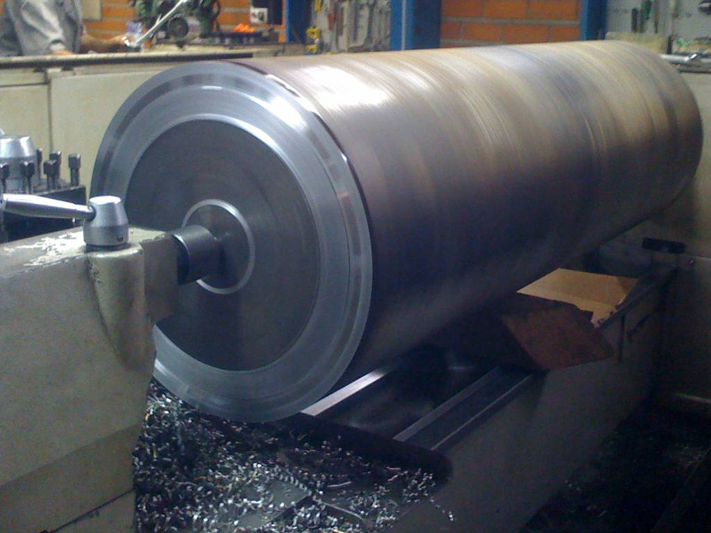

# Serviços

## Projetos

Nossa equipe de projetistas compreende engenheiros e técnicos capazes de desenvolver projetos mecânicos para diversas soluções.

Idealizamos um levantamento de dados, e apresentamos uma solução que pode ser visualizada facilmente a partir de nossos mockups virtuais, realizados com ferramentas de desenho em 2D e 3D.

Nosso conhecimento aliado a experiência de atuação em variados setores da indústria, potencializa nossa capacidade de desenvolvimento com ótimo custo benefício

## Manutenção e Instalação Elétrica e Mecânica Industrial

Nossa equipe de colaboradores compreende mecânicos, soldadores, eletricistas, auxiliares e técnicos hábeis para desenvolver diversas atividades nos mais variados setores da indústria.

Trabalhamos sempre buscando realizar nossos serviços com qualidade intrínseca, atentando a segurança e o atendimento das necessidades de nossos clientes em todos os aspectos (documentações pertinentes, procedimentos e normas internas e demais solicitações).

Uma parte de nossas atribuições:
 
* Manutenção de máquinas e dispositivos diversos;
* Instalações elétricas em geral;
* Montagem de layout industrial;
* Redes de ar comprimido (galvanizada e PPCR);
* Reforma e/ou otimização de máquinas;

Entre outros.

## Usinagem
 
Dispomos de maquinário e profissionais gabaritados para lhe fornecer serviços de usinagem aliados ou não aos nossos serviços de manutenção. Fabricamos peças em pequena escala, mas com qualidade garantida. Nosso maior potencial está na manutenção de induzidos de motores, flangeamento de válvulas, fabricação de eixos diversos, fabricação de rolos e roletes, e usinagem de precisão.

Nossas Máquinas:

* Tornos Universais;
* Fresadoras Ferramenteiras;
* Plaina;
* Furadeira de coluna;
* Furadeiras de bancada;
* Entre outras.

|| |
|---|---|
|| |
|| |

## Soldagens

Trabalhamos com os processos MIG, TIG e eletrodo revestido. Realizamos soldagens em diversos aços e ligas. Dispomos de equipamentos diversos bem como os portáteis, para realizarmos soldas diretamente nos locais onde são solicitadas;

Nossa equipe de técnica de soldadores participa continuamente de treinamentos e palestras para especializações e atualizações.

|| |
|---|---|

<Footer></Footer>